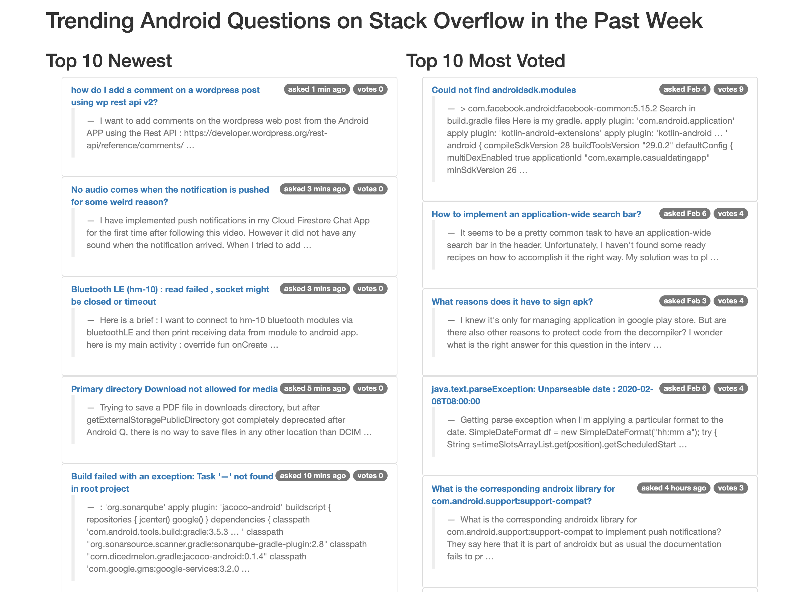

# Trending Android questions on StackOverflow in the past week

## Problem definition

> Extracting from stackoverflow.com the 10 newest Android-related questions, as well as the 10 most voted Android-related questions that are created in the past week；
> Building a simple website that displays the titles of the extracted questions
> Providing a convenient way of displaying the full question thread after I click on one of the titles；
> Adding a cool feature that you came up with yourself (please explain the feature in your documentation)

The output is a webpage displaying the requested information.

## Demo and Features

The result webpage can be accessed publicly here:

TODO.

This is a graphical overview of the webpage:



## Analysis and Project Structure

The key steps to accomplish this task are: 
1). To access a certain url; 
2). To extract desired information from HTML;
3). For future reuse, save parsed information to a database (mongodb in this case); and 
4). to display the information on a webpage. 

Many modern programming languages provide built-in packages for internet connection via HTTP (`requests package in Python` for example). In addition to the built-in package, there are multiple third-party packages that provide more functionality. In `Python` ecosystem, `Scrapy` is a powerful tool that can tackle the first two problems. `Flask`-a lightweight WSGI web application framework-is used for displaying the result in a webpage. 

### Project Structure

```
.
├── LICENSE
├── README.md
├── fetch_data.py                 <-- a service that fetches data from SO
├── mongodb                       <-- Database 
│   ├── data
│   ├── logs
│   │   └── mongo.log
│   └── mongo.conf
├── scrapy.cfg                     <-- Scrapy configuration 
├── server.py                      <-- web server 
├── stackoverflow                  <-- SO spider
│   ├── __init__.py
│   ├── items.py
│   ├── middlewares.py
│   ├── pipelines.py
│   ├── settings.py
│   └── spiders
│       ├── __init__.py
│       └── so-spider.py
├── templates                        <-- webpage template files
│   ├── home.html
│   └── index.html
└── requirements.txt                  <-- python dependencies 

```

## Requirements

- Python 3.x

  More python depencies can be found in the `requirements.txt` file.

## How to Run

### Run locally 

1. Clone repo and navigate to project root folder
2. Create virtual environment: `$python -m venv venv`
3. Activate virtual environment: `$source venv/bin/activate` , on windows, switch to corresponding cmd. 
4. Install python dependencies: `$pip install -r requirements.text`
5. Run web server: `$ python server.py`
6. Open 'http://localhost:5000/' in a local web browser to see the result page
7. Refresh web page to grab new data

### Deploy on Heroku

To do.

## Reflections

The current implementation has utilized `scrapy` to crawl StackOverflow questions and store the results in a MongoDB. While not demonstrated currently on the demo website due to time constraints, the scraped data is available and can be used for future analysis. 

There are areas where immediate improvements can be made:

1. Export the data to a more human accessible format for example `csv`.
2. Cloud based data pipeline, such as AWS can also be utilized for research project. AWS even has a research funding program that provides college students and professors with free computation credits. 
3. Utilize more advanced frontend tools/framework such as Vue.js, React.js to make the website more interactive and appealing.  